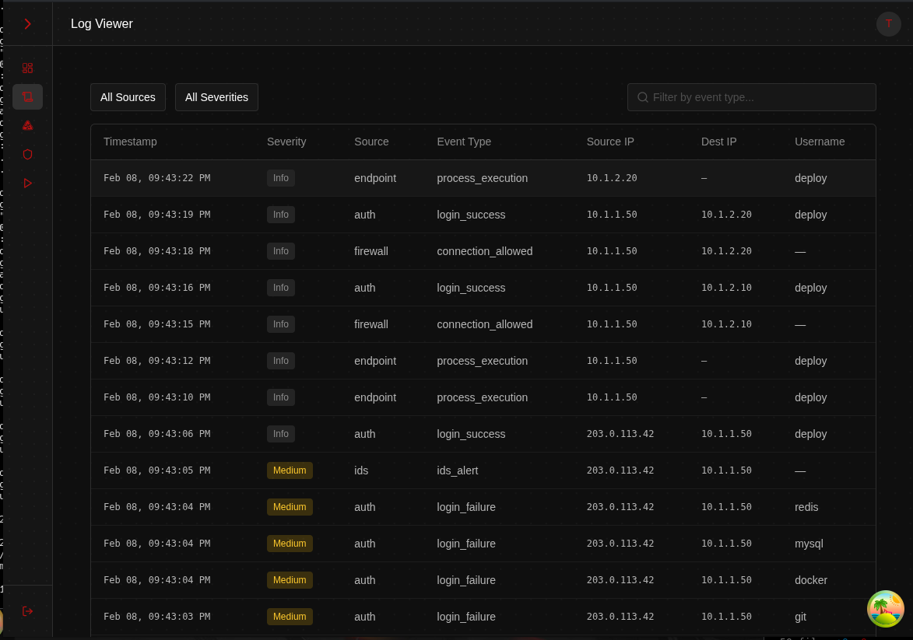

<!-- ©AngelaMos | 2026 — README.md -->

# SIEM Dashboard

A full-stack Security Information and Event Management dashboard with a built-in attack scenario simulation engine. Run realistic cyberattack playbooks, watch log events flow through a correlation engine in real time, and investigate generated alerts — all from the browser.

**Live Demo:** [siem.carterperez-dev.com](https://siem.carterperez-dev.com)

---

## Dashboard

Real-time overview of ingested events, active alerts, severity distribution, and top source IPs.



## Log Viewer

Paginated, filterable log table showing every event ingested by the system — firewall, auth, IDS, endpoint, DNS, and proxy logs. Click any row to inspect the full normalized payload.


## Alerts

Alerts fire when correlation rules detect suspicious patterns in the event stream. Each alert shows the matched rule, severity, status, grouped source, and the specific events that triggered it. Analysts can acknowledge, investigate, resolve, or mark as false positive.


## Correlation Rules

Define detection logic using three rule types:

- **Threshold** — fire when N events from the same group occur within a time window
- **Sequence** — fire when an ordered series of event patterns appears (e.g. failed logins followed by a success)
- **Aggregation** — fire when distinct values of a field exceed a threshold (e.g. one IP hitting 10+ ports)


## Scenario Engine

Four YAML-based attack playbooks mapped to real MITRE ATT&CK techniques. Start a scenario, adjust playback speed, pause/resume — events flow through the full pipeline in real time.

| Playbook | Techniques | Events |
|----------|-----------|--------|
| Brute Force with Lateral Movement | T1110.001, T1021.004 | 29 |
| Data Exfiltration via DNS Tunneling | T1046, T1005, T1048.003, T1071.004 | 22 |
| Phishing to C2 Beaconing | T1566.001, T1204.002, T1059.001, T1071.001, T1573.002 | 18 |
| Privilege Escalation and Persistence | T1068, T1136.001, T1053.005, T1070.002 | 20 |


## How It Works

```
YAML Playbook ──→ Scenario Thread (replays events with timing)
                        │
                        ▼
                  LogEvent.ingest()
                        │
            ┌───────────┴────────────┐
            ▼                        ▼
     MongoDB (logs)          Redis Stream (XADD)
                                │
                     ┌──────────┴──────────┐
                     ▼                     ▼
           Correlation Engine       SSE Generator
           (XREADGROUP)              (XREAD)
                │                      │
          Rule.evaluate()              ▼
                │               Frontend Live Feed
                ▼
          Alert.create()
                │
        ┌───────┴───────┐
        ▼               ▼
  MongoDB (alerts)   Alert SSE → Frontend
```

## Tech Stack

| Layer | Stack |
|-------|-------|
| Backend | Flask, MongoEngine, Redis Streams, Pydantic, Argon2, JWT |
| Frontend | React 19, TypeScript, Vite, TanStack Query, Zustand, visx, SCSS Modules |
| Data | MongoDB 8, Redis 7 |
| Infra | Docker Compose, Nginx, Gunicorn |

## Quick Start

```bash
git clone <repo-url>
cd siem-dashboard
docker compose -f dev.compose.yml up --build
```

- **App:** http://localhost:8431
- **API:** http://localhost:8431/api/v1

Register an account, create a correlation rule, start a scenario, and watch the data flow.

## Learn More

See the [`learn/`](learn/) folder for in-depth documentation on SIEM concepts, architecture decisions, implementation walkthroughs, and extension challenges.
